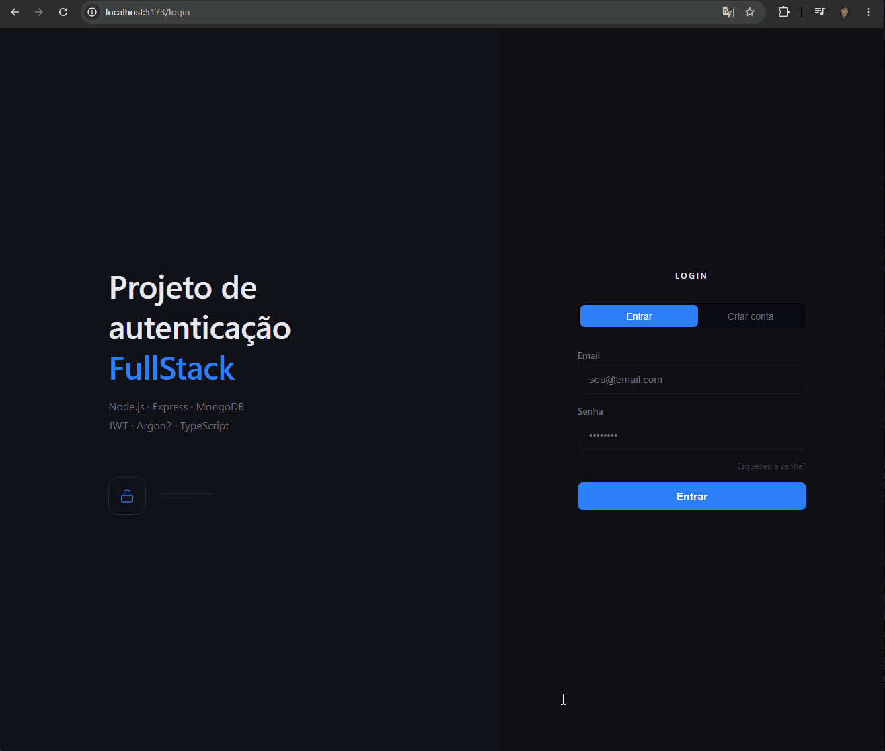
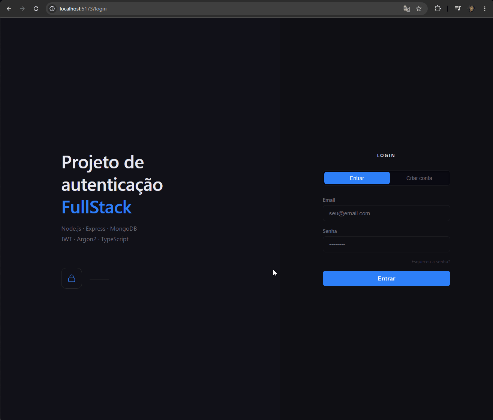

# Projeto-auth

Sistema completo de autenticação desenvolvido com foco em **boas práticas de segurança no backend**, construído com Node.js, TypeScript, Express, MongoDB, JWT e Argon2.

> Este projeto foi desenvolvido com objetivo de aprendizado, com ênfase no desenvolvimento backend — arquitetura de APIs REST, autenticação segura, modelagem de dados e segurança em camadas.

---

## Tecnologias Utilizadas

### Backend (foco principal)

| Tecnologia         | Versão   | Finalidade                                  |
| ------------------ | -------- | ------------------------------------------- |
| Node.js            | 20.x LTS | Runtime JavaScript no servidor              |
| TypeScript         | 5.x      | Tipagem estática e segurança de código      |
| Express            | 4.x      | Framework HTTP para criação da API REST     |
| MongoDB            | 7.x      | Banco de dados NoSQL orientado a documentos |
| Mongoose           | 9.x      | ODM para modelagem e validação de dados     |
| Argon2             | latest   | Hash seguro de senhas                       |
| JSON Web Token     | 9.x      | Autenticação stateless via tokens assinados |
| express-rate-limit | latest   | Proteção contra força bruta e DDoS          |
| Helmet             | latest   | Headers de segurança HTTP automáticos       |
| dotenv             | latest   | Gerenciamento de variáveis de ambiente      |
| CORS               | latest   | Controle de origens permitidas              |

### Frontend

| Tecnologia            | Finalidade                            |
| --------------------- | ------------------------------------- |
| React 19 + TypeScript | Interface do usuário                  |
| Vite                  | Bundler e servidor de desenvolvimento |
| React Router DOM      | Roteamento entre páginas              |
| Axios                 | Requisições HTTP com interceptors     |
| Context API           | Estado global de autenticação         |

---

## Arquitetura do Projeto

```
projeto-auth/
├── backend/                    ← foco principal do projeto
│   ├── src/
│   │   ├── config/
│   │   │   ├── database.ts     ← conexão com MongoDB
│   │   │   └── env.ts          ← validação de variáveis de ambiente
│   │   ├── controllers/
│   │   │   └── authController.ts  ← lógica de registro, login, getMe, forgotPassword e resetPassword
│   │   ├── middlewares/
│   │   │   ├── authMiddleware.ts  ← validação do JWT
│   │   │   └── rateLimitMiddleware.ts  ← rate limiting
│   │   ├── models/
│   │   │   └── User.ts         ← Schema e Model do usuário
│   │   ├── routes/
│   │   │   └── authRoutes.ts   ← definição das rotas
│   │   ├── types/
│   │   │   ├── env.d.ts        ← tipagem das variáveis de ambiente
│   │   │   ├── express.d.ts    ← extensão do Request do Express
│   │   │   └── index.ts        ← interfaces compartilhadas
│   │   ├── utils/
│   │   │   └── tokenUtils.ts   ← geração e verificação do JWT
│   │   └── server.ts           ← entrada da aplicação
│   ├── .env.example
│   ├── nodemon.json
│   ├── tsconfig.json
│   └── package.json
│
└── frontend/
    ├── src/
    │   ├── components/
    │   │   ├── AuthButton.tsx
    │   │   ├── AuthInput.tsx
    │   │   └── ProtectedRoute.tsx
    │   ├── context/
    │   │   └── AuthContext.tsx
    │   ├── hooks/
    │   │   └── useAuth.ts
    │   ├── pages/
    │   │   ├── LoginPage.tsx
    │   │   ├── RegisterPage.tsx
    │   │   ├── DashboardPage.tsx
    │   │   ├── ForgotPasswordPage.tsx
    │   │   └── ResetPasswordPage.tsx
    │   ├── services/
    │   │   └── api.ts
    │   └── types/
    │       └── index.ts
    └── package.json
```

---

## Rotas da API

| Método | Rota                        | Proteção         | Descrição                             |
| ------ | --------------------------- | ---------------- | ------------------------------------- |
| `GET`  | `/home`                     | Pública          | Verifica se o servidor está no ar     |
| `POST` | `/api/auth/register`        | Rate limit       | Cadastra novo usuário                 |
| `POST` | `/api/auth/login`           | Rate limit       | Autentica usuário e retorna JWT       |
| `GET`  | `/api/auth/me`              | JWT + Rate limit | Retorna dados do usuário logado       |
| `POST` | `/api/auth/forgot-password` | Rate limit       | Gera token de redefinição de senha    |
| `POST` | `/api/auth/reset-password`  | Rate limit       | Redefine a senha com o token recebido |

---

## Fluxo de Autenticação

### Registro

```
Frontend → POST /api/auth/register { name, email, password }
        → Validação em camadas (controller + mongoose)
        → Verifica duplicidade de email
        → argon2.hash(password) → hash seguro
        → User.create({ name, email, hashedPassword })
        → Retorna 201 com dados públicos (sem senha)
```

### Login

```
Frontend → POST /api/auth/login { email, password }
        → User.findOne({ email })
        → argon2.verify(hash, passwordDigitada)
        → jwt.sign({ id }, JWT_SECRET, { expiresIn: '7d' })
        → Retorna 200 com token + dados públicos
Frontend → localStorage.setItem('token')
        → Redireciona para /dashboard
```

### Rota Protegida

```
Frontend → GET /api/auth/me
        → Header: Authorization: Bearer <token>
        → authMiddleware: jwt.verify(token) → { id }
        → req.userId = id
        → User.findById(req.userId).select('-password')
        → Retorna 200 com dados do usuário
```

### Esqueci minha senha

```
Frontend → POST /api/auth/forgot-password { email }
        → User.findOne({ email })
        → email não existe → mesma resposta (evita enumeração)
        → crypto.randomBytes(32) → token único de 64 chars
        → resetTokenExpiry = Date.now() + 30 minutos
        → Salva resetToken e resetTokenExpiry no usuário
        → Retorna 200 com resetToken (em produção seria enviado por email)
```

### Redefinir senha

```
Frontend → POST /api/auth/reset-password { token, newPassword }
        → User.findOne({ resetToken: token, resetTokenExpiry: { $gt: now } })
        → token inválido ou expirado → 400
        → argon2.hash(newPassword) → novo hash seguro
        → Atualiza password, limpa resetToken e resetTokenExpiry
        → Retorna 200 — token não pode ser reutilizado
```

---

## Segurança Implementada

### Backend

- **Argon2id** — para hash de senhas
- **JWT com expiração** — tokens expiram em 7 dias, payload mínimo (só o ID)
- **Rate Limiting** — 10 tentativas de autenticação por IP a cada 15 minutos
- **Helmet** — headers HTTP de segurança automáticos (XSS, clickjacking, MIME sniffing)
- **CORS restrito** — apenas origens permitidas explicitamente
- **Body limit** — requisições limitadas a 10kb (proteção contra DoS)
- **Mensagens genéricas** — "Email ou senha incorretos" sem especificar qual (evita enumeração)
- **Senhas nunca retornadas** — campo `password` excluído em todas as respostas
- **Variáveis de ambiente validadas** — servidor não inicia sem todas as variáveis obrigatórias
- **Reset token seguro** — gerado com `crypto.randomBytes(32)`, expira em 30 minutos e é invalidado após o uso

### Frontend

- **Interceptor Axios** — token injetado automaticamente em todas as requisições
- **Interceptor de erro global** — token inválido/expirado remove sessão automaticamente
- **ProtectedRoute** — rotas privadas verificam autenticação antes de renderizar
- **Validação local** — erros de formulário tratados antes de chegar na API
- **Reset de senha** — email não confirmado na interface (evita enumeração de usuários)

---

## Como Executar

### Pré-requisitos

- Node.js 20.x ou superior
- MongoDB rodando localmente ou MongoDB Atlas
- npm ou yarn

### Backend

```bash
cd backend

# Instalar dependências
npm install

# Configurar variáveis de ambiente
cp .env.example .env
# Edite o .env com suas configurações

# Iniciar em desenvolvimento
npm run dev

# Build para produção
npm run build
npm start
```

### Frontend

```bash
cd frontend

# Instalar dependências
npm install

# Iniciar em desenvolvimento
npm run dev
```

> Observação: para produção ou enviroment local, crie um arquivo `frontend/.env` com:
>
> ```env
> VITE_API_URL=http://localhost:5000
> ```
>
> Isso garante que as requisições Axios usem a URL da API correta.

### Variáveis de Ambiente (backend)

```env
PORT=5000
MONGODB_URI=mongodb://localhost:27017/accesscontrol
JWT_SECRET=gere_um_secret_forte_com_64_bytes
JWT_EXPIRES_IN=7d
NODE_ENV=development
```

> Para gerar um JWT_SECRET seguro:
>
> ```bash
> node -e "console.log(require('crypto').randomBytes(64).toString('hex'))"
> ```

---

## Status HTTP Utilizados

| Código | Nome                  | Quando é retornado                    |
| ------ | --------------------- | ------------------------------------- |
| `200`  | OK                    | Requisição bem sucedida               |
| `201`  | Created               | Usuário criado com sucesso            |
| `400`  | Bad Request           | Dados inválidos ou campos faltando    |
| `401`  | Unauthorized          | Token inválido ou credenciais erradas |
| `403`  | Forbidden             | Autenticado mas sem permissão         |
| `404`  | Not Found             | Recurso não encontrado                |
| `409`  | Conflict              | Email já cadastrado                   |
| `500`  | Internal Server Error | Erro inesperado no servidor           |

---

## Aprendizados de Backend

Este projeto foi desenvolvido com o objetivo de aprender e praticar:

- Arquitetura de APIs REST com separação de responsabilidades (routes → controllers → models)
- Tipagem completa com TypeScript no backend (interfaces, generics, declaration merging)
- Autenticação stateless com JWT — geração, assinatura e validação
- Hash seguro de senhas com Argon2 — salt automático, comparação sem reversão
- Modelagem de dados com Mongoose — Schema tipado, validações, timestamps
- Middlewares no Express — autenticação, rate limiting, CORS, helmet
- Segurança em camadas — validação no frontend, controller e banco de dados
- Variáveis de ambiente — validação centralizada, nunca expor segredos
- Boas práticas de segurança — mensagens genéricas, payload mínimo no JWT, body limit
- Fluxo de reset de senha — token temporário com `crypto`, expiração e invalidação após uso
- Operadores do MongoDB — `$gt` para comparação de datas em queries

---

## Demo

### Registro e Login


### Esqueci minha senha


---

## Autor

Desenvolvido como projeto de aprendizado de desenvolvimento web full stack,  
com foco em backend e autenticação segura.
